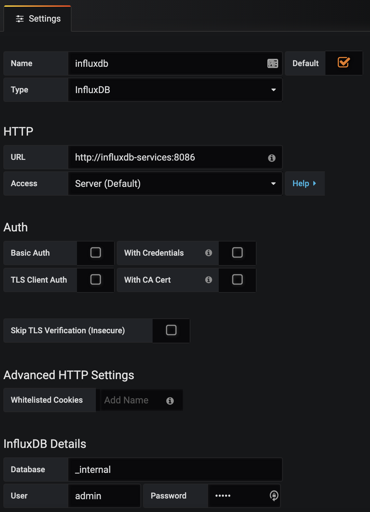
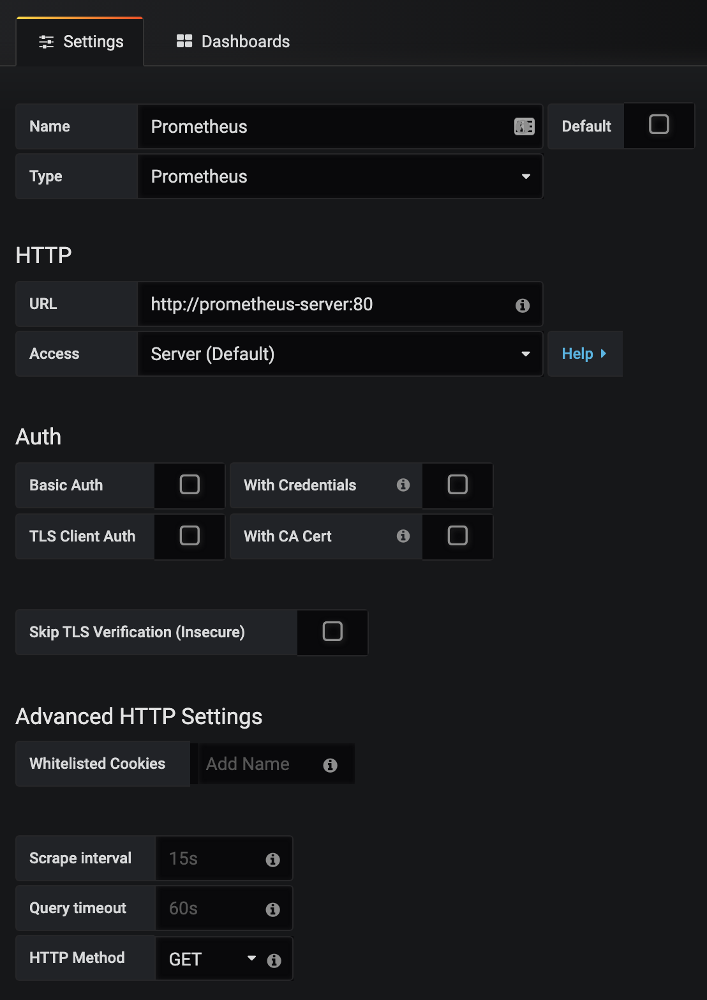

Pokemon Translator API
---
_...Pokemon Translator ..._

### Preconditions
Install the following software:
- [terraform ](https://www.terraform.io/)
- [minikube](https://kubernetes.io/docs/tasks/tools/install-minikube/)
- [virtualbox](https://www.virtualbox.org/wiki/Downloads)
- [docker](https://docs.docker.com/get-docker/)
- [ab](https://httpd.apache.org/docs/2.4/programs/ab.html)
- [jq](https://stedolan.github.io/jq/)

**Important:**
The default user and password for Grafana, influxDB, Prometheus, Telegraf is admin/admin

### Test Build Images and RUN
Clone the repository.
``` bash
$ cd pokemon_api_translator
$ docker build -t adecchi/truelayer:v1.0 .
$ docker run -it -p 80:8000 adecchi/truelayer:v1.0
$ curl -X GET http://localhost/status;echo
$ curl -X GET http://localhost/pokemon/charizard | jq
```

### Test Build Images and RUN with docker-compose
Clone the repository.
``` bash
$ cd pokemon_api_translator
$ docker-compose up -d
$ curl -X GET http://localhost/status;echo
$ curl -X GET http://localhost/pokemon/charizard | jq
$ docker-compose down
```

### WEBSERVERS SETUP
Clone the repository.
Execute the following commands to build the Python image inside minikube.
``` bash
$ cd pokemon_api_translator
$ minikube start
$ eval $(minikube docker-env)
$ docker build -t adecchi/truelayer:v1.0 .
```

Enable the Nginx Ingress.
``` bash
$ minikube addons enable ingress
```
Enable the Metrics Server.
``` bash
$ minikube addons enable metrics-server
```
Configure the k8s cluster using Terraform, it can take near 5 min estimated.
Terraform will use the context minikube configured in `~/.kube/config`
``` bash
$ cd pokemon_api_translator/terraform
$ terraform init
$ terraform validate
$ terraform plan -out pokemon.plan
$ terraform apply "pokemon.plan"
```
If you get an error please re-run it. 
The following error are expected, but you can continue. The error is due the LB integration with minikube.
``` text
Error: Waiting for service "monitoring/grafana-services" to assign IP/hostname for a load balancer
on service.tf line 45, in resource "kubernetes_service" "grafana-services":
  45: resource "kubernetes_service" "grafana-services" {
```
Check that all PODs are running, if not please re-run terraform
``` bash
$ kubectl get pods -A
```
Test Python webserver version, the command will return the url to connect.
``` bash
$ minikube service truelayer-python-services -n truelayer --url 
```
Append the host endpoint entry to `/etc/hosts`
``` bash
$ sudo echo $(minikube ip) pokemon.truelayer.com >> /etc/hosts
```
Test status URL endpoint.
``` bash
$ curl -X GET http://pokemon.truelayer.com/status;echo
```
If you want to destroy the K8S cluster, please run.
``` bash
$ cd pokemon_api_translator/terraform
$ terraform destroy
```

### RATE LIMIT:
The rate limit was configured to 5 qps/rps/tps, counted by client IP, with a buffer for 25 burst which is non-delayed. 
The burst number is 5 times the rate limit according to the [document](https://kubernetes.github.io/ingress-nginx/user-guide/nginx-configuration/annotations/#rate-limiting).
Therefore, we should be able to calculate the expected number of successful requests for the previous test with the formula:

    successful requests = period * rate + burst

That’s 20 second * 5 qps + 25 burst = 125 requests. It still doesn't look close to our test result of 371.
To show the rate limit configuration, you can execute the following command once deployed with terraform:

``` bash
$ kubectl get pods -n kube-system | grep ingress-nginx-controller
$ kubectl exec -it -n kube-system <POD-NAME> -- cat /etc/nginx/nginx.conf | grep limit
```

The http status code for rate limit is 503 (Services Unavailable), you can change it to 429 (too many request), modifying
the setting:

``` bash
limit_req_status 429;
limit_conn_status 429;
```

### UPDATE LIMIT:
Edit the `ingress.tf` file line `6` and then execute:
``` bash
$ terraform fmt
$ terraform validate
$ terraform plan -out pokemon.plan
$ terraform apply "pokemon.plan"
```

### CACHE:
Cache is configured for 1 minute, we can get the status of our request looking the header `X-Cache-Status`
Here we list the different state of the cache.
``` bash
X-Cache-Status: HIT
X-Cache-Status: MISS
X-Cache-Status: EXPIRED
```
To show the cache configuration, you can execute the following command once deployed with terraform:

``` bash
$ kubectl get pods -n kube-system | grep ingress-nginx-controller
$ kubectl exec -it -n kube-system <POD-NAME> -- cat /etc/nginx/nginx.conf | grep keys_zone
$ kubectl exec -it -n kube-system <POD-NAME> -- cat /etc/nginx/nginx.conf | grep proxy_zone
```

### UPDATE CACHE:
Edit the `ingress.tf` file line `8` and then execute:
``` bash
$ terraform fmt
$ terraform validate
$ terraform plan -out pokemon.plan
$ terraform apply "pokemon.plan"
```


### PROMETHEUS SETUP:
Get the prometheus endpoint running the following command.
``` bash
$ minikube service prometheus-services -n monitoring
```

### GRAFANA SETUP:
Get the grafana endpoint running the following command.
``` bash
$ minikube service grafana-services -n monitoring --url
```
Configure InfluxDB datasource like this:


Configure Prometheus datasource like this:


Go to (+) icon, select "import" and in "Grafana.com Dashboard" paste the following link, to import K8S cluster Dashboard.
Please remember to import into the "Prometheus data source."
``` text
https://grafana.com/grafana/dashboards/10856
```

Go to (+) icon, select "import" and in "Grafana.com Dashboard" paste the following link, to import Nginx Ingress Dashboard.
Please remember to import into the "Prometheus data source."
``` text
https://grafana.com/grafana/dashboards/9614
```

### LOAD TEST:
Using Apache Benchmark (ab): You can append `-v 2` to visualize the http status code.
``` bash
$ ab -n 1000 -c 100 -s 60 -m GET http://pokemon.truelayer.com/pokemon/charizard
```

Using curl command:
``` bash
$ while true;do curl -X GET http://pokemon.truelayer.com/pokemon/charizard;done
```

### Commands to Debugs
minikube
``` bash
$ minikube stop
$ minikube start
$ minikube status
$ minikube ssh
$ minikube service list
$ minikube addons list | grep enabled
```

K8S
``` bash
$ kubectl get pods -A
$ kubectl get services -A
$ kubectl get ingress -A
$ kubectl get deployments -A
$ kubectl config set-context --current --namespace=NAMESPACE_NAME
$ kubectl describe pod POD_NAME -n NAMESPACE_NAME
$ kubectl describe service SERVICE_NAME -n NAMESPACE_NAME
$ kubectl describe ingress INGRESS_NAME -n NAMESPACE_NAME
$ kubectl describe deployment DEPLOYMENT_NAME -n NAMESPACE_NAME
$ kubectl logs POD_NAME -n NAMESPACE_NAME
$ kubectl exec --stdin --tty POD_NAME -- /bin/sh
```

### Why I choose what I choose ?

##### terraform:
Because, it is an standard in IaC, it has a long community. Many people contribute writing code, modules, libraries.
On the other hand, is very fast, maintain the state of the infrastructure, can work in a CI/CD, support many provider,
low curve to learn.
In this example, I use to create the K8S using minikube, but we can adapt to run in Google Cloud, Amazon AWS, Azure an others.
We can create monitors, dashboard, alert in Datadog, NewRelic and other providers while we are creating the K8S cluster.
##### minikube:
I was a long time using minikube as there is simply alternatives and to be honest it does a pretty good job at being a 
local Kubernetes for development environment. You can create the cluster, wait a few minutes and you are ready to go. 
Here my comparison table:

| feature | minikube | kind | k3s |
| ------ | ------ | ------ | ------ |
| runtime | VM | CONTAINER | NATIVE |
| architectures | AMD64| AMD64 | AMD64, ARMv7, ARM64 |
| container runtimes | Docker, CRI-O, Containerd, Gvisor | Docker | Docker, Containerd |
| startup time initial/following | 5:19 | 2:48 / 1:06 | 0:15 / 0:15 |
| memory requirements | 2GB | 8GB | 512MB |
| requires root? | NO | NO | YES |
| multi-cluster support | YES | YES | NO |
| multi-node support | NO | YES | YES |
| project page | [minikube](https://minikube.sigs.k8s.io/) | [kind](https://kind.sigs.k8s.io/) | [k3s](https://k3s.io/) |

##### prometheus:
Because it is the industry Standard and supports multidimensional data collection and data queuing.
Prometheus is reliable, allowing to quickly diagnose problems. Since each server is independent, it can be leaned on when 
other infrastructure is damaged, without requiring additional infrastructure.
Prometheus:
- Features a customizable toolkit, and delivers metrics without creating lag time on performance.
- Cloud-native applications and infrastructure such as Kubernetes. 
- Keep tabs on hundreds of microservices .
- Only alerts on critical responses such as production issues, incident response, post- mortem analysis, and metrics.
- Features a Node Exporter that can be customized to fetch data from any clients.
- Can be integrated with Grafana to show Dashboards.

##### grafana:
Is open source visualization and analytics software. It allows you to query, visualize, alert on, and explore 
your metrics no matter where they are stored.
It provides you with tools to turn your time-series database data into beautiful graphs and visualizations.
Easy to integrate with Prometheus and create your Dashboards.

##### docker:
It is the de facto Standard to build and share containerized applications and supported for many providers and container orchestrators.
It provides:
- Security
- Isolation
- Reproducible Image
- Easy CD/CI

### Pending Improvements
- Improve rate limit, exponential backoff and retries with the external APIs.
- Improve LRU Cache and Ingress Cache.
- Improve Exception Handling.
- Improve liveness and readiness probes.
- Create automation script to deploy all the requirements and application.
- Improve test cases.
- Improve documentation.
- Improve monitoring, dashboards and alerts.
- Create some CI/CD using GitHub, GitLab.
- Create/migrate the actual Terraform code to Modules.